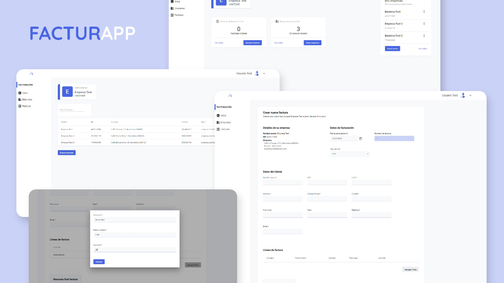

 
- [Descripción general](#descripción-general)
- [Arquitectura del servicio](#arquitectura-del-servicio)
  - [Back-end](#back-end)
  - [Front-end](#front-end)
- [Tecnologías y patrones](#tecnologías-y-patrones)
  - [Back-end](#back-end-1)
  - [Front-end](#front-end-1)
- [Uso](#uso)
  
# Descripción general
Proyecto Full-stack para la gestión de facturas. En la parte del servidor he desarrollado una API Rest desarrollada con .NET 6 y en del cliente se ha desarrollado una SPA (Single Page Application) con Angular.

# Arquitectura del servicio
## Back-end
El servicio esta distribuido en 3 capas diferentes, cada una con sus propias responsabilidades y permiten mantener nuestro código separado y ordenado: 
* Core: capa central del proyecto que contiene la definición de las entidades que forman parte de la lógica de negocio, las interfaces de los patrones utilizados para realizar las operaciones CRUD y que las demás capas del proyecto implementan.
* Bussiness Logic: en ella aplicamos los diferentes patrones de diseño y demás lógica que forma parte de los casos de uso, así como la conexión con la base de datos. Depende directamente de la capa de central.
* Presentación (WebApi): encargada de conectar nuestro sistema con el mundo exterior y en este caso donde aplicamos la arquitectura API Rest, contiene los controladores y el mapeo de entidades.
## Front-end
En cuanto a la estructura de la aplicación SPA hay que destacar las siguientes carpetas:
* models: definición del conjunto de entidades de la lógica de negocio para poder realizar operaciones CRUD con consistencia.
* pages: conjunto de componentes angular que forman el layout base de la aplicación. Cada una de ellas contiene sus propia capeta de componentes y las "sub páginas" que la componen.
* guards: encontramos los diferentes middlewares de autenticación y autorización que permiten o deniegan a los usuarios el acceso a los diferentes recursos.
* store: aglutina los módulos para gestionar las operaciones CRUD y el estado global de la aplicación para cada entidad implicada en el ciclo de vida de la aplicación.

# Tecnologías y patrones
## Back-end
* Visual Studio
* C#
* .Net Core 6.0 Web Api
* Patrón Repositorio
* Patrón Especificación
* JWT para sistema de autenticación
* Entity Framework como ORM
* Mapper para el mapeo de entidades
## Front-end
* Visual Studio
* Angular CLI v14
* NGRX y RxJS para la gestión del estado global de la aplicación y trabajar con operaciones asíncronas, consumo de Api, filtrado y operaciones CRUD. 
* Material UI como biblioteca de estilos para implementar componentes Angular con un diseño basado en Material Design.

# Uso
Para ejecutar el servidor debes tener instalado el SDK de .NET 6.0. Después clona o descarga este repositorio y ejecute el siguiente comando.
```
dotnet run --project .\BuberDinner.Api\
```

Para ejecutar la aplicación web de Angular ejecuta el siguiente comando.
```
ng run start:dev
```